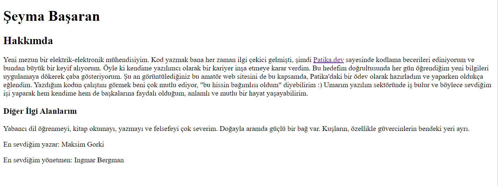

# HTML Dersinin İlk Ödevi
Ödevin konusu, kendimizi tanıtan çok basit bir sayfayı HTML ile hazırlamak. Yorum satırları, başlık kullanımı gibi temel konulardaki kazanımlarımızı pratiğe dökmek. 
Web sitesi, ödevde istendiği şekilde "index.html" adıyla kaydedilmiş olup tarayıcınızda açtığınızda aşağıdaki gibi görünecektir: 
