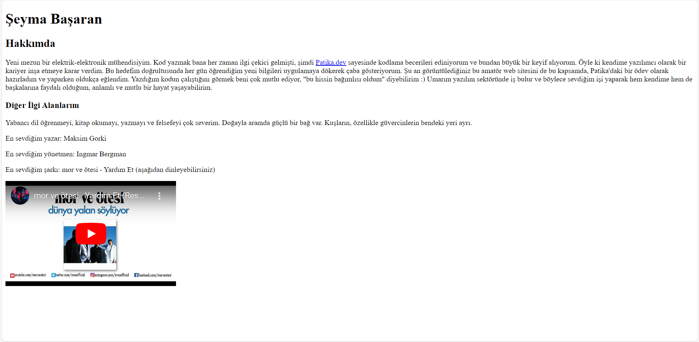

# First HTML Homework
The subject of the homework is to prepare a very simple web page with HTML to introduce ourselves. This is to put into practice the basic concepts like *comment lines* and the use of *headings*.

The website is saved with the name "index.html" as required in the assignment, and when you open it in your browser, the website will look as follows:

